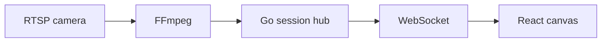
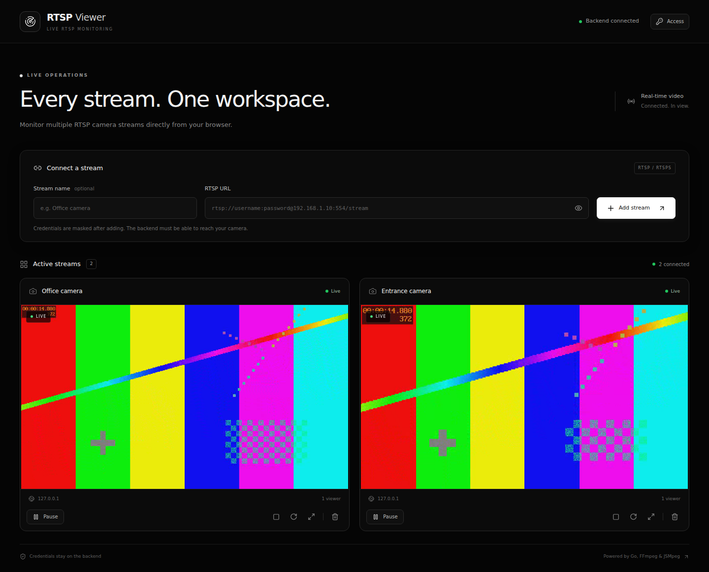
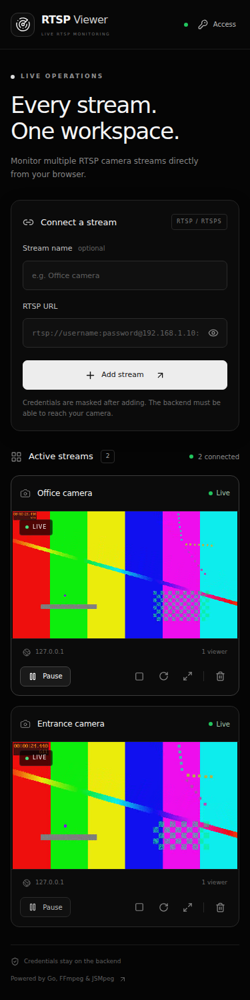

# RTSP Stream Viewer

A working browser workspace for multiple RTSP cameras. React and TypeScript render live video on canvas; Go owns camera sessions, FFmpeg transcodes video to MPEG-1 in MPEG-TS, and WebSockets deliver binary video to JSMpeg. The interface uses a restrained near-black theme, responsive cards, and viewer-level playback controls.

## Architecture



One canonical RTSP URL owns one FFmpeg process. All subscribers to its stream ID share that process. Each client has a bounded 32-chunk queue; a slow subscriber is disconnected rather than blocking everyone or dropping arbitrary MPEG bytes. A fresh decoder is created whenever a viewer reconnects, so old bytes are not mixed with a new transcoder session.

The backend owns raw credentials. API snapshots redact the complete userinfo and every query value. The browser holds binary video outside React state, directly between a WebSocket and the JSMpeg demuxer. JSMpeg is vendored at a pinned commit with its MIT license; no runtime CDN is needed.

## Stack and features

- React 19, strict TypeScript, Vite, Tailwind CSS, Lucide icons, Sonner notifications.
- Go 1.25+, Gorilla WebSocket, FFmpeg, MediaMTX for genuine RTSP test feeds.
- Add named cameras; responsive one-, two-, or three-column layouts; live/connecting/reconnecting/error/paused states.
- Viewer Play/Pause, source Start/Stop/Restart, Remove, fullscreen, real viewer counts.
- Input validation on both sides, JSON API errors, exact CORS origins, optional local access token and mandatory protected production configuration.
- Capped reconnect backoff, RTSP/data timeouts, bounded buffers, synchronized lifecycle operations and graceful shutdown.
- Native setup, Windows and POSIX publishing scripts, Docker Compose, deployable demo container, Vercel settings, Render Blueprint and CI checks.

No fake cameras, fabricated latency numbers, HLS substitute, database, or Redux store is used.

Source: [github.com/vishvajeet2012/RTSP](https://github.com/vishvajeet2012/RTSP).

## Live production

The app is hosted on AWS EC2 (`65.1.110.203`) behind Cloudflare:

| Surface | URL |
| ------- | --- |
| Frontend | https://rtsp.vishvajeetshukla.in |
| API health | https://rtsp-api.vishvajeetshukla.in/api/health |
| API + WebSocket | https://rtsp-api.vishvajeetshukla.in |

Open the frontend, click **Access**, and enter the backend `API_TOKEN`. The token is never compiled into the frontend. Cloudflare terminates HTTPS for visitors; nginx on the instance reverse-proxies `rtsp.vishvajeetshukla.in` to static files and `rtsp-api.vishvajeetshukla.in` to the Go process on `127.0.0.1:8080`.

Production environment for this host:

```dotenv
PORT=8080
APP_ENV=production
ALLOWED_ORIGINS=https://rtsp.vishvajeetshukla.in,http://rtsp.vishvajeetshukla.in
ALLOWED_RTSP_HOSTS=127.0.0.1,localhost
```

Frontend build-time origins:

```dotenv
VITE_API_URL=https://rtsp-api.vishvajeetshukla.in
VITE_WS_URL=wss://rtsp-api.vishvajeetshukla.in
```

To allow a real camera, add its exact hostname or IP to `ALLOWED_RTSP_HOSTS` and restart the systemd service. The EC2 instance must be able to reach that camera over TCP. Private `192.168.x.x` cameras need a VPN or tunnel. Keep `API_TOKEN` in `/home/ubuntu/rtsp-stream-viewer/.env` on the server; do not commit it.

Nginx, systemd, and env templates for this layout live in [`deploy/ec2/`](deploy/ec2/).

## Screenshots

The screenshots are captured from the running app with real generated RTSP feeds:





## Folder structure

| Location                                    | Responsibility                                                               |
| ------------------------------------------- | ---------------------------------------------------------------------------- |
| `frontend/src/components/`                  | Header, form, grid, cards, canvas player, controls, access dialog and states |
| `frontend/src/hooks/`                       | API state/polling and managed WebSocket reconnects                           |
| `frontend/src/services/`                    | Typed API client and JSMpeg binary source bridge                             |
| `frontend/src/types/`, `utils/`             | Strict stream/player types, URL helpers and utility tests                    |
| `frontend/public/vendor/`                   | Pinned JSMpeg bundle, upstream license and provenance                        |
| `backend/cmd/server/`                       | Configuration, dependency wiring and HTTP shutdown                           |
| `backend/internal/config/`, `models/`       | Environment parsing, URL/name validation and sanitized public snapshots      |
| `backend/internal/services/`                | FFmpeg lifecycle, watchdog and synchronized stream manager                   |
| `backend/internal/websocket/`               | Subscriber hub, socket read/write pumps and hub registry                     |
| `backend/internal/handlers/`, `middleware/` | JSON routes, one-use viewer tickets, CORS, authentication and logging        |
| `backend/pkg/response/`                     | JSON success/error responses                                                 |
| `backend/deploy/`                           | Hosted generated demo feeds and supervised startup                           |
| `mediamtx/`, `scripts/`                     | Local RTSP server configuration and POSIX/PowerShell publishers              |
| `tests/e2e/`, `.github/workflows/`          | Real browser workflow and build/test CI                                      |
| `docker-compose.yml`, `render.yaml`         | Container development and hosted demo configuration                          |
| `deploy/ec2/`                               | Nginx, systemd and env templates for the live EC2 + Cloudflare host          |
| `docs/VERIFICATION.md`                      | Checks actually performed and environment limitations                        |

## Quickest local run: all Docker

Install Docker with Compose. From the extracted repository:

```sh
docker compose --profile web up --build
```

Open **http://localhost:5173**. Add either of these URLs in the UI:

```text
rtsp://mediamtx:8554/test
rtsp://mediamtx:8554/test2
```

These hostnames are resolved by the backend container. Two test publishers automatically generate moving test patterns. The first starts at 960×540 and the second at 640×360. Allow a few seconds for their initial startup.

Stop everything with `docker compose --profile web down`. Backend state is cleared when its process restarts.

**Important networking distinction:** with the Docker backend, `localhost` points at that container. Use `mediamtx` to reach the Compose RTSP server. With a native Go backend on your computer, use `rtsp://localhost:8554/test` instead.

## Native development

Prerequisites: Node.js 20.19+ (22+ recommended), Go 1.25+, FFmpeg with `libx264` and `mpeg1video`, and Docker for MediaMTX (or a native MediaMTX binary). Install Go and FFmpeg on PATH. Camera traffic uses RTSP over TCP.

### 1. Install and configure

```sh
npm ci
cp frontend/.env.example frontend/.env
cp backend/.env.example backend/.env
```

PowerShell equivalents:

```powershell
npm ci
Copy-Item frontend/.env.example frontend/.env
Copy-Item backend/.env.example backend/.env
```

### 2. Start real test cameras

```sh
docker compose up -d mediamtx test-publisher test-publisher-2
```

Alternatively run only `docker compose up -d mediamtx`, then publish from your own FFmpeg in a separate terminal:

```sh
bash scripts/start-test-stream.sh
```

Windows:

```powershell
powershell -ExecutionPolicy Bypass -File scripts/start-test-stream.ps1
```

To loop a local video instead:

```sh
bash scripts/start-test-stream.sh rtsp://localhost:8554/test /path/to/video.mp4
```

```powershell
.\scripts\start-test-stream.ps1 -Url rtsp://localhost:8554/test -VideoFile C:\Videos\sample.mp4
```

Do not run a script and a Compose publisher for the same path simultaneously. Keep a script's terminal open for as long as you need the camera feed.

### 3. Backend terminal

```sh
cd backend
go mod download
go run ./cmd/server
```

### 4. Frontend terminal

```sh
npm run dev
```

Open **http://localhost:5173**, then add `rtsp://localhost:8554/test` and `rtsp://localhost:8554/test2`.

## Environment variables

Go loads a `.env` in its working directory if present; container hosts supply environment variables directly. Vite consumes frontend variables **at build time**. Redeploy the frontend after changing them.

| Variable                        | Default / purpose                                                                 |
| ------------------------------- | --------------------------------------------------------------------------------- |
| `PORT`                          | `8080`; HTTP/WebSocket listener                                                   |
| `APP_ENV`                       | `development`; production enforces token and host allowlist                       |
| `FFMPEG_PATH`                   | `ffmpeg`; executable path, including `ffmpeg.exe` on Windows                      |
| `ALLOWED_ORIGINS`               | Exact comma-separated frontend origins, no paths, wildcard or trailing slash      |
| `FRONTEND_DIR`                  | Optional React build directory; the hosted demo image sets `/app/web`             |
| `ALLOWED_RTSP_HOSTS`            | Exact camera hostnames/IPs; blank allows any host locally, required in production |
| `API_TOKEN`                     | Optional locally; at least 24 characters in production                            |
| `STREAM_RECONNECT_MAX_ATTEMPTS` | `5` retries after the initial FFmpeg attempt                                      |
| `RTSP_TIMEOUT_SECONDS`          | `20`; socket I/O and no-video watchdog                                            |
| `MAX_STREAMS`                   | `6`; bounds simultaneous transcoders                                              |
| `MAX_CLIENTS_PER_STREAM`        | `20`; bounds subscribers per camera                                               |
| `LOG_LEVEL`                     | `info`; `debug` includes sanitized FFmpeg diagnostics                             |
| `VITE_API_URL`                  | Backend HTTP(S) origin, e.g. `https://backend.example`                            |
| `VITE_WS_URL`                   | Backend WS(S) origin; omitted derives `wss://` from HTTPS                         |

The container frontend uses same-origin Nginx proxying, so its build leaves Vite origins empty. The native examples explicitly target port 8080. Never compile an API token into a `VITE_` variable; enter it using **Access**. Tokens are kept in tab memory and cleared by reload.

## API

| Method | Endpoint                      | Purpose                                                        |
| ------ | ----------------------------- | -------------------------------------------------------------- |
| GET    | `/api/health`                 | Public health, `{"status":"ok","ffmpeg":true}` or 503 degraded |
| POST   | `/api/streams`                | Create and start a stream with `name` (optional) and `rtspUrl` |
| GET    | `/api/streams`                | Ordered sanitized stream snapshots                             |
| GET    | `/api/streams/{id}`           | One sanitized snapshot                                         |
| DELETE | `/api/streams/{id}`           | Reap process, close viewers and remove metadata                |
| POST   | `/api/streams/{id}/start`     | Start source; idempotent while running                         |
| POST   | `/api/streams/{id}/stop`      | Stop the source for **all** viewers                            |
| POST   | `/api/streams/{id}/restart`   | Reap the old process before starting a new one                 |
| POST   | `/api/streams/{id}/ticket`    | Issue one-use 60-second browser WebSocket ticket               |
| WS     | `/ws/streams/{id}?ticket=...` | Binary MPEG-TS video, ping/pong and socket cleanup             |

When authentication is configured, every API route except health requires `Authorization: Bearer <API_TOKEN>`. A WebSocket requires its stream-scoped ticket; when running without a token, native clients can connect directly. The browser requests a new ticket for each reconnect. Tickets and passwords are excluded from request logs.

```sh
curl -X POST http://localhost:8080/api/streams \
  -H 'Content-Type: application/json' \
  -d '{"name":"Office camera","rtspUrl":"rtsp://localhost:8554/test"}'
```

Errors use `{"error":"friendly message"}`. URL duplicates return 409, missing streams 404, malformed input 400, limits 429, and missing FFmpeg 503. Wrong camera credentials, unavailable sources and crashes update `lastError` and stream status asynchronously. No raw FFmpeg command or stderr is exposed through the API.

## Controls and reconnect behavior

**Pause** disconnects only that browser subscription and pauses its decoder; the last frame stays visible. The backend and other viewers continue running. **Play** reconnects with a fresh decoder and resumes at live video, with no replay backlog. **Stop source** (square icon) stops the shared FFmpeg process; **Restart** and **Remove** also affect every viewer of that camera.

Backend failures retry after 1, 2, 4, 8 and 15 seconds by default, then show Error. A camera stable for 30 seconds resets the failure budget. The browser separately retries unexpected socket failures with capped exponential backoff and an eight-retry budget; authorization, removed-stream and stopped-source failures require a user action. Silent sockets and RTSP sources time out. Manual Restart renews the retry budget.

The FFmpeg encoder emits MPEG-1/YUV420p at 25 FPS with no B-frames, one encoder thread, one-second GOPs, maximum width 960, 1200k target bitrate and a small MPEG-TS mux delay. The camera preview is deliberately video-only. Byte chunks are aligned to 188-byte transport packets. Actual end-to-end camera latency is not fabricated or displayed.

## Verification

```sh
npm run typecheck
npm run lint
npm test
npm run build
cd backend
go fmt ./...
go vet ./...
go test -race ./...
go build -o bin/server ./cmd/server
```

With the test publishers running:

```sh
cd backend
TEST_RTSP_URL=rtsp://localhost:8554/test go test -race ./...
```

Browser workflow from the repository root:

```sh
npx playwright install chromium
TEST_RTSP_URL=rtsp://localhost:8554/test \
TEST_RTSP_URL_2=rtsp://localhost:8554/test2 npm run test:e2e
```

PowerShell: set `$env:TEST_RTSP_URL` and `$env:TEST_RTSP_URL_2`, then run `npm run test:e2e`. Real integration tests skip when their RTSP variables are absent. Run browser tests against an isolated local workspace without an access token; they clear its streams during setup.

The Go integration test checks genuine binary RTSP-to-WebSocket fan-out, exactly one transcoder for two subscribers, Stop, Restart and Remove cleanup. Playwright checks actual colorful canvas pixels, two cameras, pause retaining the frame, restart, source stop/start, removal and mobile overflow. CI also builds Docker and runs those integration checks.

## Deployment: EC2 production, single container, or Vercel frontend

### GitHub source repository

The source lives at [https://github.com/vishvajeet2012/RTSP](https://github.com/vishvajeet2012/RTSP).

```sh
git clone https://github.com/vishvajeet2012/RTSP.git
cd RTSP
```

### Native production on AWS EC2 (current live host)

This is how [rtsp.vishvajeetshukla.in](https://rtsp.vishvajeetshukla.in) and [rtsp-api.vishvajeetshukla.in](https://rtsp-api.vishvajeetshukla.in) are served. Ubuntu 26.04, nginx, FFmpeg, a systemd Go process, and Cloudflare orange-cloud DNS.

1. Point `rtsp` and `rtsp-api` A records at the instance (proxied). Open security-group ports 80 and 443.
2. Install nginx, FFmpeg, and Go 1.25+ on the instance.
3. Build the frontend with the production Vite origins, copy `frontend/dist` to `/var/www/rtsp-viewer`, and build `backend/cmd/server` to `/home/ubuntu/rtsp-stream-viewer/bin/server`.
4. Install [`deploy/ec2/rtsp-stream-viewer.service`](deploy/ec2/rtsp-stream-viewer.service) and [`deploy/ec2/nginx.conf`](deploy/ec2/nginx.conf). Copy [`deploy/ec2/.env.example`](deploy/ec2/.env.example) to `/home/ubuntu/rtsp-stream-viewer/.env` and set a 24+ character `API_TOKEN` plus camera hosts.
5. `sudo systemctl enable --now rtsp-stream-viewer` and reload nginx.

Cloudflare SSL **Full** needs HTTPS on the origin (a self-signed certificate is enough for Full, not Full Strict). Flexible SSL talks HTTP to the origin instead. WebSockets must stay enabled on the `rtsp-api` hostname.

```sh
sudo systemctl status rtsp-stream-viewer
curl -sS https://rtsp-api.vishvajeetshukla.in/api/health
```

After changing `.env`, run `sudo systemctl restart rtsp-stream-viewer`. Stream metadata is in memory and resets on restart.

### One Render service with the frontend and working demo cameras

Use the root `render.yaml` Blueprint, or create a Docker Web Service with **Dockerfile path `backend/Dockerfile.demo`**, **Docker build context `.` (repository root)**, and health path `/api/health`. This image builds React and Go, serves the frontend and API from one origin, and includes two generated RTSP publishers on backend loopback. No separate frontend hosting or Vite API variables are needed. A reviewer can add:

```text
rtsp://127.0.0.1:8554/test
rtsp://127.0.0.1:8554/test2
```

The Blueprint sets `APP_ENV=production` and `ALLOWED_RTSP_HOSTS=localhost,127.0.0.1`, generates a random `API_TOKEN`, and selects the Free compute plan explicitly. When `ALLOWED_ORIGINS` is omitted, the server uses Render's exact `RENDER_EXTERNAL_URL`. For a custom domain or another frontend, set `ALLOWED_ORIGINS` explicitly to the allowed origins.

Open the service's HTTPS URL, enter its generated API token in the **Access** dialog, and add either demo camera above. Copy the token from your Render environment settings; keep it out of GitHub and the frontend bundle. Share reviewer access separately. The API uses HTTPS and the browser derives WSS automatically from the shared origin.

Build this complete image locally from the repository root:

```sh
docker build -f backend/Dockerfile.demo -t rtsp-viewer-demo .
```

The Free plan has cold starts and a small CPU quota. Multiple software transcoders need sufficient compute; performance on Render is not verified until an actual deployment is exercised. Changing the Blueprint's plan changes the service's compute allocation.

If hosting real cameras, use `backend/Dockerfile` instead and set their reachable hostnames in the allowlist. A cloud backend cannot reach a home/office `192.168.x.x` camera unless you provide an appropriate private network/VPN route. The demo container avoids that problem without exposing an RTSP listener publicly.

Choose a service with enough CPU for simultaneous software transcoders. Keep one backend instance running; stream ownership is in memory. The generated demo publishers also use CPU even before a viewer connects.

### Optional separate Vercel frontend

Import your GitHub repository. Set **Root Directory: `frontend`**, framework **Vite**, build **`npm run build`**, output **`dist`**. The root npm workspace lockfile is committed. Configure:

```dotenv
VITE_API_URL=https://YOUR_BACKEND_HOST
VITE_WS_URL=wss://YOUR_BACKEND_HOST
```

Deploy, set `ALLOWED_ORIGINS` to allow that exact deployed origin on the backend, open the app, enter the backend token, and add the hosted demo URL above. Add a preview deployment's exact origin separately if needed. HTTPS frontend pages require HTTPS API and WSS sockets.

Go + FFmpeg + persistent WebSockets belong on a long-running Docker host, not Vercel serverless. For Railway's complete demo, use repository root as the build context and `backend/Dockerfile.demo`. The API-only real-camera image uses `backend/Dockerfile` with build context `backend`. Any comparable container host can run these images.

The source is deployment-ready; uploading it does not itself create a GitHub repository or publish a live service.

Official references: [Vercel monorepos](https://vercel.com/docs/monorepos), [Render Docker](https://render.com/docs/docker), [Render Blueprint fields](https://render.com/docs/blueprint-spec), [JSMpeg](https://github.com/phoboslab/jsmpeg), [Gorilla WebSocket](https://pkg.go.dev/github.com/gorilla/websocket), [MediaMTX](https://github.com/bluenviron/mediamtx).

## Troubleshooting and limitations

| Symptom                             | Check                                                                                          |
| ----------------------------------- | ---------------------------------------------------------------------------------------------- |
| Backend offline                     | Go process, port, frontend API origin and HTTPS configuration                                  |
| FFmpeg unavailable                  | Install FFmpeg, verify `ffmpeg -version`, fix `FFMPEG_PATH`                                    |
| Camera connection fails             | TCP network reachability, hostname allowlist, camera path and credentials                      |
| RTSPS TLS support error             | Use FFmpeg with GnuTLS and RTSP demuxer TLS controls, such as the supplied Ubuntu 26.04 images |
| Local stream unavailable in Docker  | Use `mediamtx:8554`, not `localhost:8554`                                                      |
| Connection refused while publishing | Start MediaMTX first and make sure the path has no second publisher                            |
| 401 or 403                          | Enter the configured token and allow the exact frontend Origin                                 |
| Canvas never becomes Live           | Check FFmpeg diagnostics, `mpeg1video` support and actual camera video track                   |
| Video stops                         | Check publisher/camera, retry budget and manual Restart                                        |
| State disappears after a deploy     | Stream metadata is in memory and resets on backend restart                                     |

This coding-test service has a shared workspace/admin token, not per-user accounts or isolated tenants. Input URL host allowlists are useful controls but are not a complete SSRF boundary; production networks should restrict egress and DNS resolution for untrusted inputs. MPEG-1 is less bandwidth-efficient than modern codecs. Audio, recording, seeking and historical playback are intentionally absent. Pause does not save backend transcoding CPU; Stop or Remove does. Pixel decoding uses Canvas2D for predictable compatibility and bounded per-player buffers; practical stream limits depend on browser and server resources.

## Future improvements and scalability

The present process and hub live on a single backend instance. Multiple clients reuse its output, but arbitrary horizontal scaling would need stream ownership/leases and viewer routing. Persistent PostgreSQL metadata, distributed stream workers, NATS/Redis fan-out, hardware acceleration, health metrics, stronger authentication/authorization, network isolation and WebRTC are natural extensions. Kafka or Kubernetes are possible at larger scale; they are not needed for this test.

## License

MIT. The vendored JSMpeg bundle retains its separate upstream MIT notice.
